# Mouse ICR, DMR Annotation

## [mm10 ICR Coordinate BED](20210530_mm10_ICR.bed)

## [Mouse Array ICR Annotation](20210530_mm10_ICR_MM285.tsv)

https://raw.githubusercontent.com/zhou-lab/ImprintingAnno/master/track/hub.txt

# Mouse (mm10)

## [Plagl1, Zac1 (chr10:13090289-13091600)](https://genome.ucsc.edu/cgi-bin/hgTracks?hgS_doLoadUrl=submit&hgS_loadUrlName=https://github.com/zhou-lab/ImprintingAnno/blob/master/img/Plagl1.txt?raw=true)
[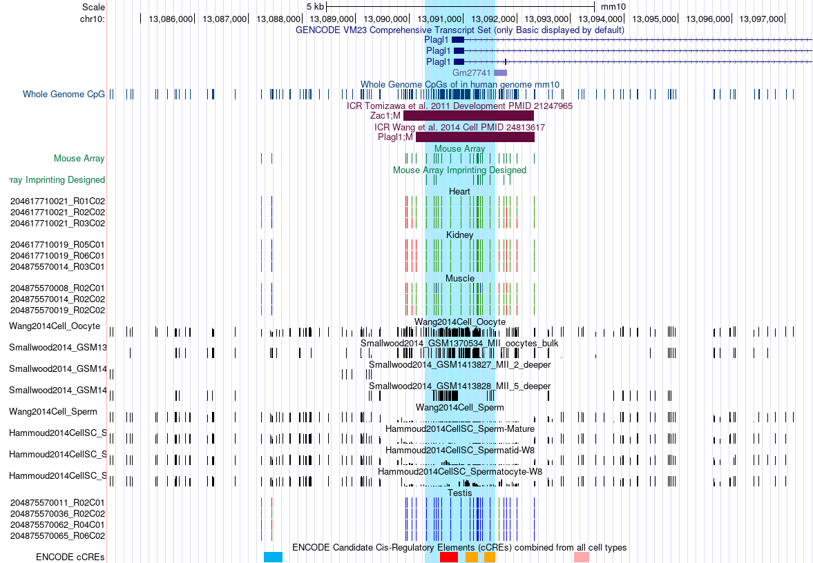](https://genome.ucsc.edu/cgi-bin/hgTracks?hgS_doLoadUrl=submit&hgS_loadUrlName=https://github.com/zhou-lab/ImprintingAnno/blob/master/img/Plagl1.txt?raw=true)

## [Grb10 (chr11:12025451-12025844)](https://genome.ucsc.edu/cgi-bin/hgTracks?hgS_doLoadUrl=submit&hgS_loadUrlName=https://github.com/zhou-lab/ImprintingAnno/blob/master/img/Grb10.txt?raw=true)

## [Zrsr1, U2af1-rs1 (chr11:22971698-22973990)](https://genome.ucsc.edu/cgi-bin/hgTracks?hgS_doLoadUrl=submit&hgS_loadUrlName=https://github.com/zhou-lab/ImprintingAnno/blob/master/img/Zrsr1.txt?raw=true)
[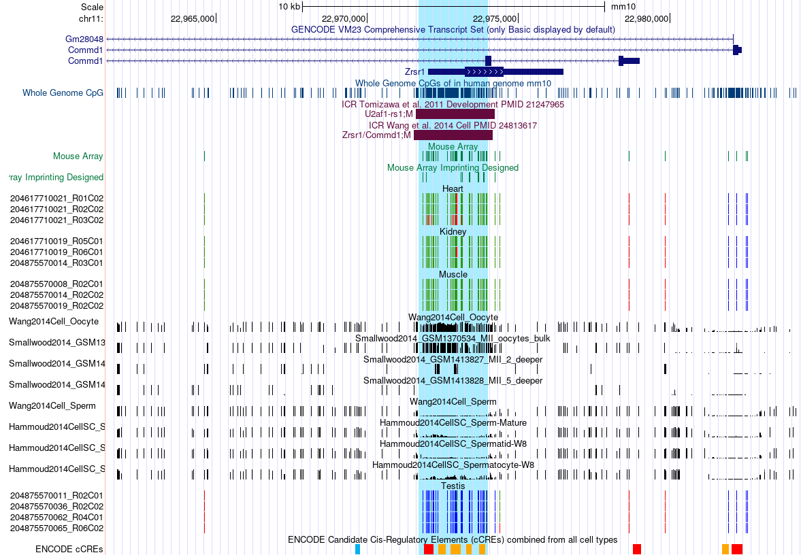](https://genome.ucsc.edu/cgi-bin/hgTracks?hgS_doLoadUrl=submit&hgS_loadUrlName=https://github.com/zhou-lab/ImprintingAnno/blob/master/img/Zrsr1.txt?raw=true)

## [Dlk1-Gtl2 (chr12:109527910-109528908)](https://genome.ucsc.edu/cgi-bin/hgTracks?hgS_doLoadUrl=submit&hgS_loadUrlName=https://github.com/zhou-lab/ImprintingAnno/blob/master/img/Dlk1.txt?raw=true)
[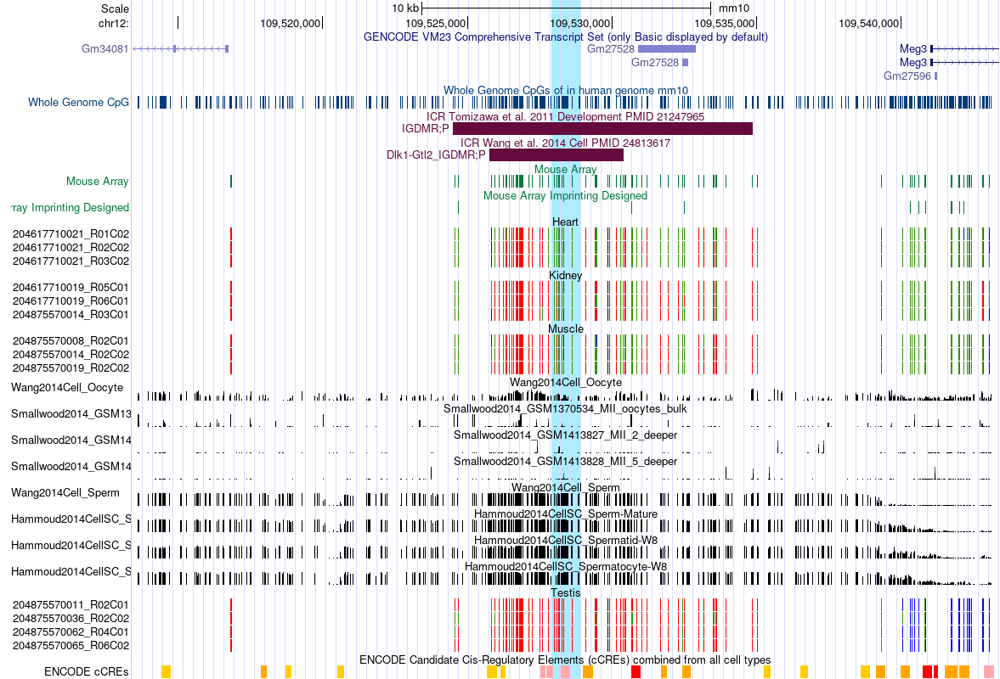](https://genome.ucsc.edu/cgi-bin/hgTracks?hgS_doLoadUrl=submit&hgS_loadUrlName=https://github.com/zhou-lab/ImprintingAnno/blob/master/img/Dlk1.txt?raw=true)

## [Peg13 (chr15:72808843-72811448)](https://genome.ucsc.edu/cgi-bin/hgTracks?hgS_doLoadUrl=submit&hgS_loadUrlName=https://github.com/zhou-lab/ImprintingAnno/blob/master/img/Peg13.txt?raw=true)
[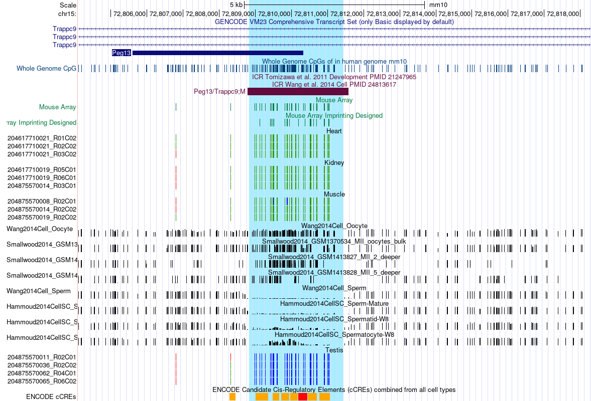](https://genome.ucsc.edu/cgi-bin/hgTracks?hgS_doLoadUrl=submit&hgS_loadUrlName=https://github.com/zhou-lab/ImprintingAnno/blob/master/img/Peg13.txt?raw=true)

## [Slc38a4 (chr15:97054004-97055720)](https://genome.ucsc.edu/cgi-bin/hgTracks?hgS_doLoadUrl=submit&hgS_loadUrlName=https://github.com/zhou-lab/ImprintingAnno/blob/master/img/Slc38a4.txt?raw=true)
[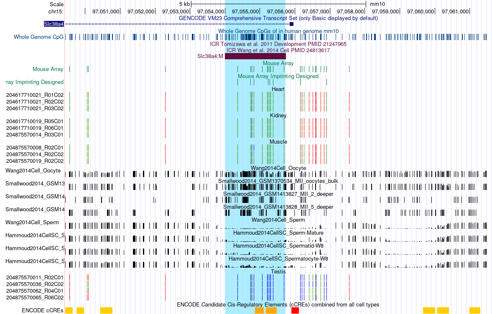](https://genome.ucsc.edu/cgi-bin/hgTracks?hgS_doLoadUrl=submit&hgS_loadUrlName=https://github.com/zhou-lab/ImprintingAnno/blob/master/img/Slc38a4.txt?raw=true)

## [Igf2r (chr17:12741763-12742936)](https://genome.ucsc.edu/cgi-bin/hgTracks?hgS_doLoadUrl=submit&hgS_loadUrlName=https://github.com/zhou-lab/ImprintingAnno/blob/master/img/Igf2r.txt?raw=true)
[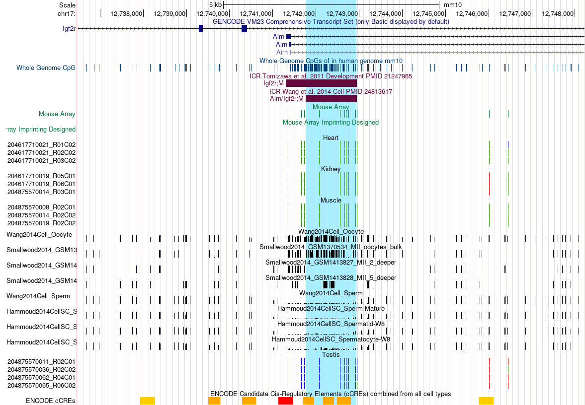](https://genome.ucsc.edu/cgi-bin/hgTracks?hgS_doLoadUrl=submit&hgS_loadUrlName=https://github.com/zhou-lab/ImprintingAnno/blob/master/img/Igf2r.txt?raw=true)

## [Impact (chr18:12972071-12974805)](https://genome.ucsc.edu/cgi-bin/hgTracks?hgS_doLoadUrl=submit&hgS_loadUrlName=https://github.com/zhou-lab/ImprintingAnno/blob/master/img/Impact.txt?raw=true)
[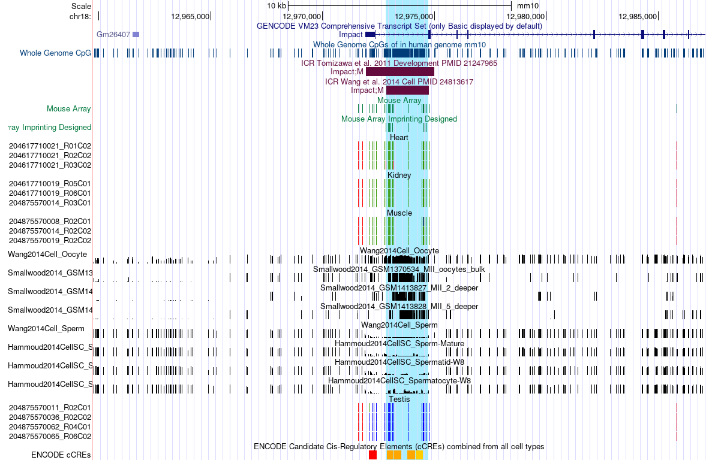](https://genome.ucsc.edu/cgi-bin/hgTracks?hgS_doLoadUrl=submit&hgS_loadUrlName=https://github.com/zhou-lab/ImprintingAnno/blob/master/img/Impact.txt?raw=true)

## [Nespas-Gnasxl (chr2:174294395-174296929)](https://genome.ucsc.edu/cgi-bin/hgTracks?hgS_doLoadUrl=submit&hgS_loadUrlName=https://github.com/zhou-lab/ImprintingAnno/blob/master/img/Nespas.txt?raw=true)
[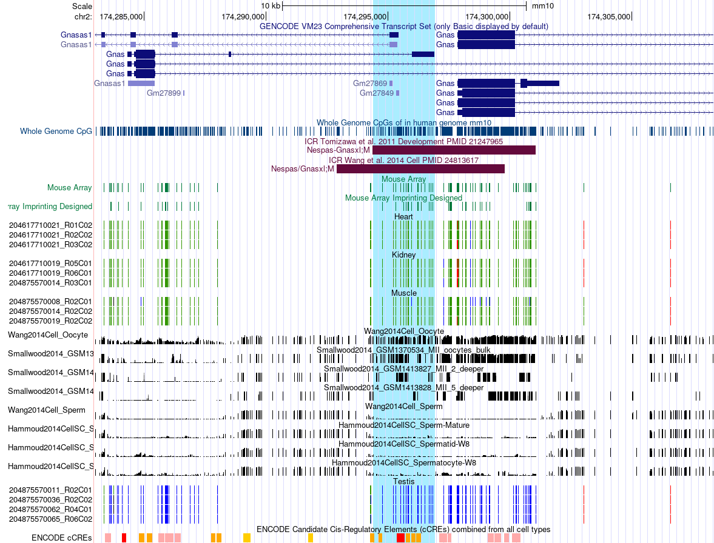](https://genome.ucsc.edu/cgi-bin/hgTracks?hgS_doLoadUrl=submit&hgS_loadUrlName=https://github.com/zhou-lab/ImprintingAnno/blob/master/img/Nespas.txt?raw=true)

## [Gnas1a (chr2:174327149-174327881)](https://genome.ucsc.edu/cgi-bin/hgTracks?hgS_doLoadUrl=submit&hgS_loadUrlName=https://github.com/zhou-lab/ImprintingAnno/blob/master/img/Gnas1a.txt?raw=true)

## [Peg10 (chr6:4746830-4749271)](https://genome.ucsc.edu/cgi-bin/hgTracks?hgS_doLoadUrl=submit&hgS_loadUrlName=https://github.com/zhou-lab/ImprintingAnno/blob/master/img/Peg10.txt?raw=true)
[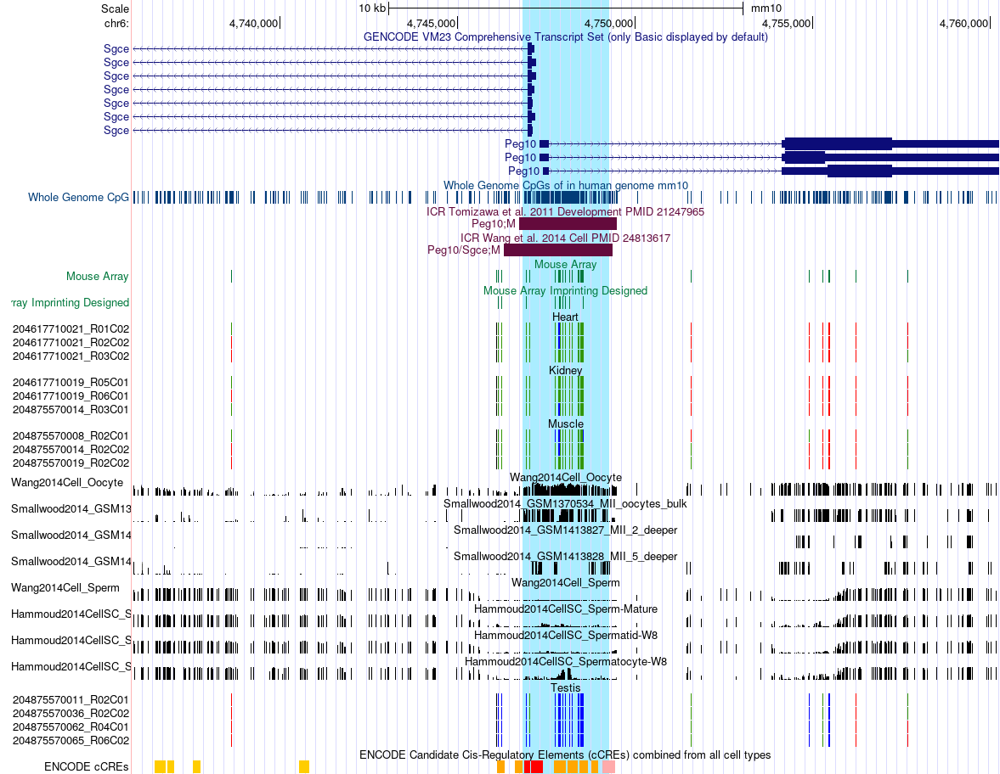](https://genome.ucsc.edu/cgi-bin/hgTracks?hgS_doLoadUrl=submit&hgS_loadUrlName=https://github.com/zhou-lab/ImprintingAnno/blob/master/img/Peg10.txt?raw=true)

## [Mest (chr6:30735884-30739580)](https://genome.ucsc.edu/cgi-bin/hgTracks?hgS_doLoadUrl=submit&hgS_loadUrlName=https://github.com/zhou-lab/ImprintingAnno/blob/master/img/Mest.txt?raw=true)
[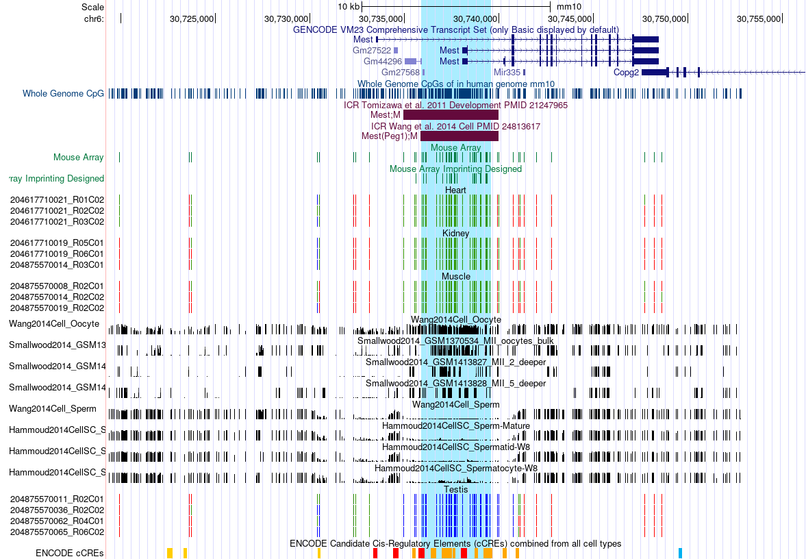](https://genome.ucsc.edu/cgi-bin/hgTracks?hgS_doLoadUrl=submit&hgS_loadUrlName=https://github.com/zhou-lab/ImprintingAnno/blob/master/img/Mest.txt?raw=true)

## [Peg3 (chr7:6727472-6731285)](https://genome.ucsc.edu/cgi-bin/hgTracks?hgS_doLoadUrl=submit&hgS_loadUrlName=https://github.com/zhou-lab/ImprintingAnno/blob/master/img/Peg3.txt?raw=true)
[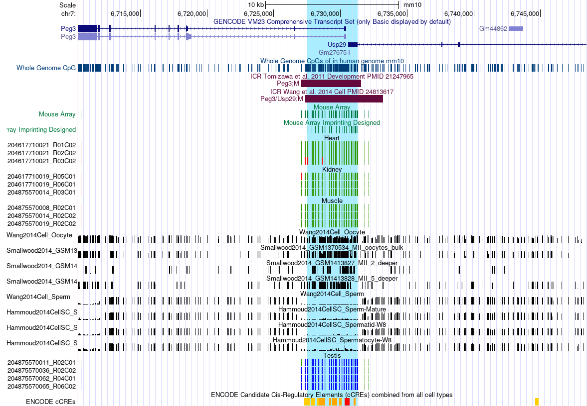](https://genome.ucsc.edu/cgi-bin/hgTracks?hgS_doLoadUrl=submit&hgS_loadUrlName=https://github.com/zhou-lab/ImprintingAnno/blob/master/img/Peg3.txt?raw=true)

## [Snrpn (chr7:60004023-60005770)](https://genome.ucsc.edu/cgi-bin/hgTracks?hgS_doLoadUrl=submit&hgS_loadUrlName=https://github.com/zhou-lab/ImprintingAnno/blob/master/img/Snrpn.txt?raw=true)
[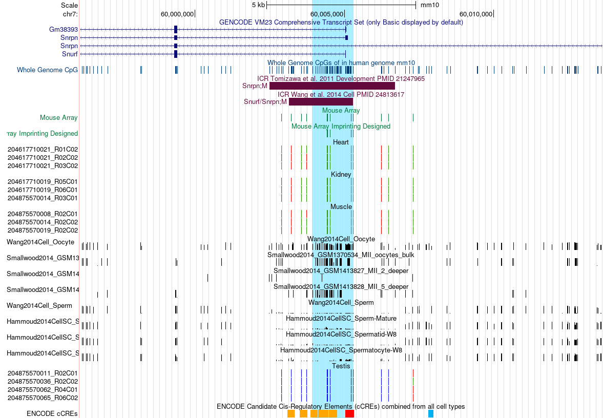](https://genome.ucsc.edu/cgi-bin/hgTracks?hgS_doLoadUrl=submit&hgS_loadUrlName=https://github.com/zhou-lab/ImprintingAnno/blob/master/img/Snrpn.txt?raw=true)

## [H19 (chr7:142579860-142581956)](https://genome.ucsc.edu/cgi-bin/hgTracks?hgS_doLoadUrl=submit&hgS_loadUrlName=https://github.com/zhou-lab/ImprintingAnno/blob/master/img/H19.txt?raw=true)
[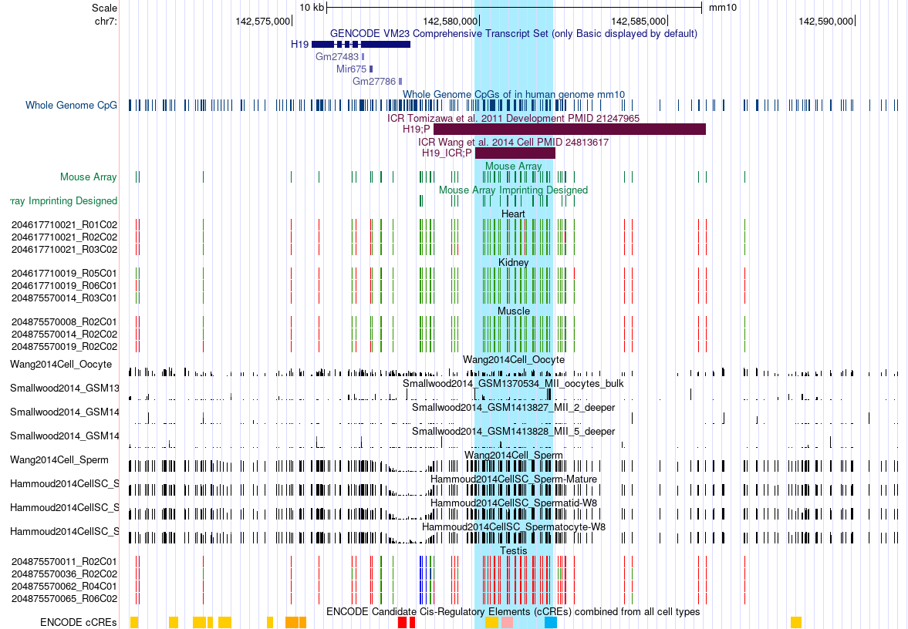](https://genome.ucsc.edu/cgi-bin/hgTracks?hgS_doLoadUrl=submit&hgS_loadUrlName=https://github.com/zhou-lab/ImprintingAnno/blob/master/img/H19.txt?raw=true)

## [Kcnq1ot1 (chr7:143294798-143296071)](https://genome.ucsc.edu/cgi-bin/hgTracks?hgS_doLoadUrl=submit&hgS_loadUrlName=https://github.com/zhou-lab/ImprintingAnno/blob/master/img/Kcnq1ot1.txt?raw=true)
[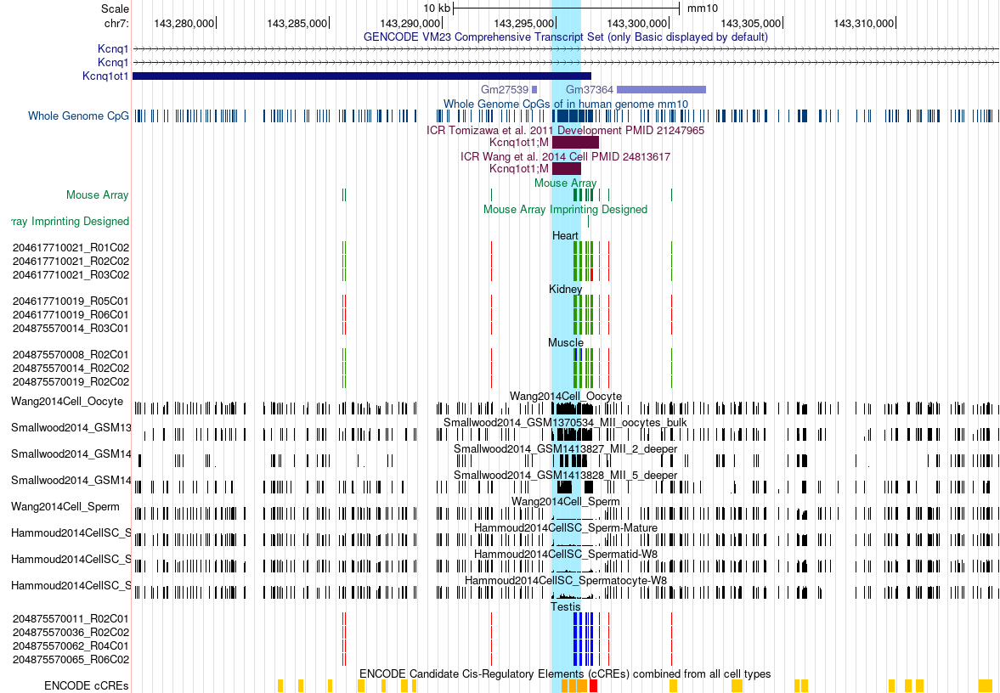](https://genome.ucsc.edu/cgi-bin/hgTracks?hgS_doLoadUrl=submit&hgS_loadUrlName=https://github.com/zhou-lab/ImprintingAnno/blob/master/img/Kcnq1ot1.txt?raw=true)

## [Rasgrf1 (chr9:89875459-89878138)](https://genome.ucsc.edu/cgi-bin/hgTracks?hgS_doLoadUrl=submit&hgS_loadUrlName=https://github.com/zhou-lab/ImprintingAnno/blob/master/img/Rasgrf1.txt?raw=true)
[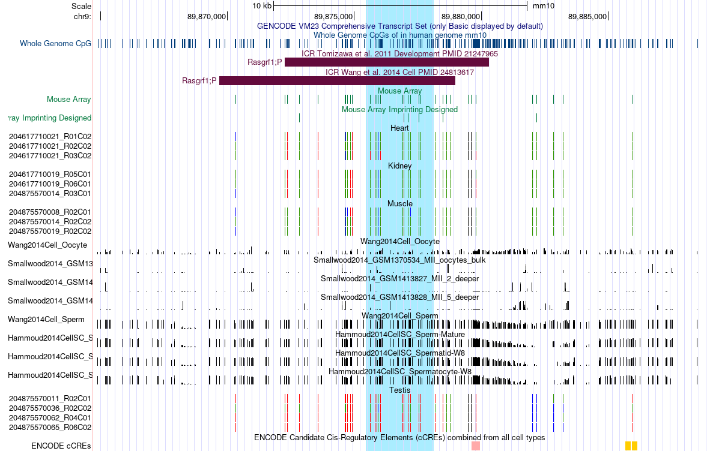](https://genome.ucsc.edu/cgi-bin/hgTracks?hgS_doLoadUrl=submit&hgS_loadUrlName=https://github.com/zhou-lab/ImprintingAnno/blob/master/img/Rasgrf1.txt?raw=true)

